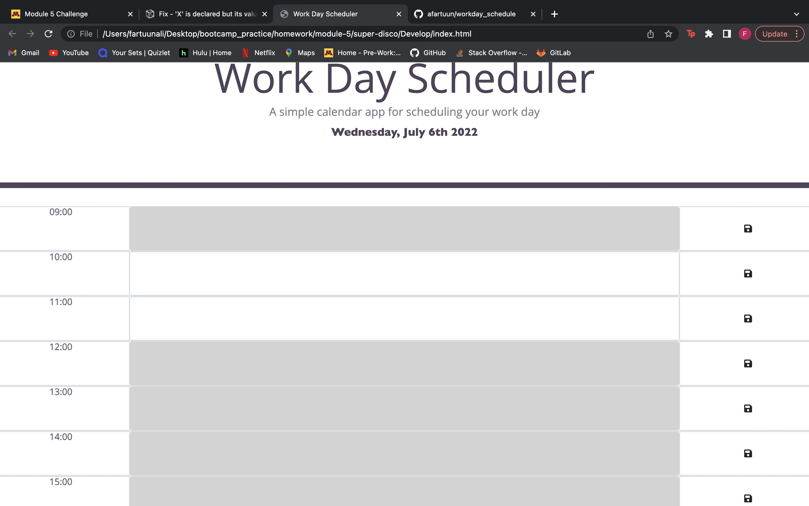

# Work Day Scheduler Starter Code
## Challenge 
### Making a day planner website that shows the current date that has features that save whatever plans you make throughout the day. 

## Screenshot of my calendar

# Work Day Scheduler

## Description

Provide a short description explaining the what, why, and how of your project. Use the following questions as a guide:

This a simple workday planner that you get you use to keep track of your hourly schedule throughout the day. 

## Table of Contents

If your README is long, add a table of contents to make it easy for users to find what they need.

- [Installation](#installation)
- [Usage](#usage)
- [Credits](#credits)

## Installation

All you have to do is access the link to the website and you are set to start planning your day!

## Usage

All you have to do is type whatever you would like to keep track of in the text box. Down below is a screenshot of what the planner looks like. 

## Credits

You can find the link to the repository on [Fartuun Ali's](https://github.com/afartuun/workday_schedule) github page.
Here is the [deployed link](https://afartuun.github.io/workday_schedule/) to access the planner website. 